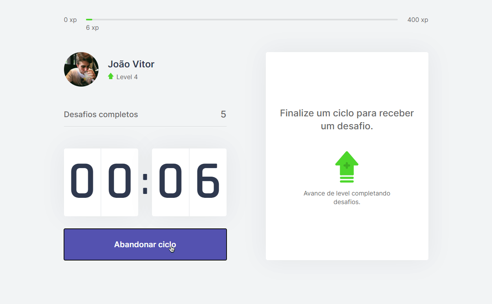

# Move it [NLW#4]

<p align="center">
   
</p>

## Teste você mesmo!

[**https://nlw4-next-seven.vercel.app**](https://nlw4-next-seven.vercel.app)

## Instalação

1. Clone o repositório:

```
    git clone https://github.com/jvbs/nlw4-next.git
    cd nlw4-next

```

2. Instale as dependências

```bash
    yarn
    # ou
    npm i

```

3. Instale em modo desenvolvimento

```bash
    yarn dev
    # ou
    npm run dev

```

4. Build

```bash
    yarn build
    # ou
    npm run build
```

5. Instale em modo de produção

```bash
    yarn start
    # ou
    npm run start

```
